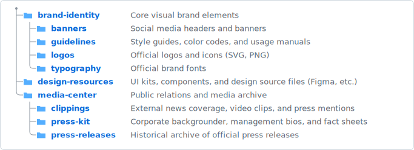
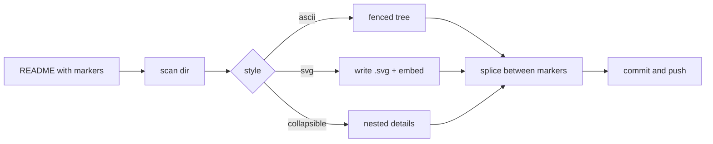

# 🌳 treegen — File Tree README Action

[](https://github.com/lucianofedericopereira/treegen/actions/workflows/ci.yml)
[](LICENSE)
[](pyproject.toml)

Drop a `[[files]]` marker into any Markdown file and let this GitHub Action
replace it with a directory tree. Choose the look:

- **`ascii`** — the classic `tree` block, with optional aligned descriptions.
- **`svg`** — a crisp SVG with folder icons that **matches GitHub's light/dark
  theme** and scales responsively.
- **`collapsible`** — a GitHub-native, expand/collapse `<details>` tree.

Pure standard-library Python (no runtime dependencies), fully type-checked with
**mypy --strict**, and designed so **anyone can drop it into their repo**.

---

## ✨ Demo

All three trees below are generated from [`examples/brand`](examples/brand) by
this very action. Edit the folders, push, and they update themselves.

### `ascii`

<!-- filetree:start dir="examples/brand" descriptions="examples/brand/.filetree.json" dirs-only="true" -->
```
├── brand-identity/      # Core visual brand elements
│   ├── banners/         # Social media headers and banners
│   ├── guidelines/      # Style guides, color codes, and usage manuals
│   ├── logos/           # Official logos and icons (SVG, PNG)
│   └── typography/      # Official brand fonts
├── design-resources/    # UI kits, components, and design source files (Figma, etc.)
└── media-center/        # Public relations and media archive
    ├── clippings/       # External news coverage, video clips, and press mentions
    ├── press-kit/       # Corporate backgrounder, management bios, and fact sheets
    └── press-releases/  # Historical archive of official press releases
```
<!-- filetree:end -->

### `svg` (folder icons · GitHub light/dark · responsive)

<!-- filetree:start dir="examples/brand" descriptions="examples/brand/.filetree.json" dirs-only="true" style="svg" svg-output="assets/example-tree.svg" title="Brand assets" -->

<!-- filetree:end -->

### `collapsible`

<!-- filetree:start dir="examples/brand" descriptions="examples/brand/.filetree.json" exclude=".filetree.json" style="collapsible" -->
<details open>
<summary><span class="ft-name">📁 <strong>brand-identity</strong></span> <em class="ft-note">Core visual brand elements</em></summary>
  <details open>
  <summary><span class="ft-name">📁 <strong>banners</strong></span> <em class="ft-note">Social media headers and banners</em></summary>
    <ul>
      <li><span class="ft-name">📄 twitter-header.png</span></li>
    </ul>
  </details>
  <details open>
  <summary><span class="ft-name">📁 <strong>guidelines</strong></span> <em class="ft-note">Style guides, color codes, and usage manuals</em></summary>
    <ul>
      <li><span class="ft-name">📄 brand-guide.pdf</span></li>
    </ul>
  </details>
  <details open>
  <summary><span class="ft-name">📁 <strong>logos</strong></span> <em class="ft-note">Official logos and icons (SVG, PNG)</em></summary>
    <ul>
      <li><span class="ft-name">📄 favicon.png</span></li>
      <li><span class="ft-name">📄 logo-mono.svg</span></li>
      <li><span class="ft-name">📄 logo-primary.svg</span></li>
    </ul>
  </details>
  <details open>
  <summary><span class="ft-name">📁 <strong>typography</strong></span> <em class="ft-note">Official brand fonts</em></summary>
    <ul>
      <li><span class="ft-name">📄 Inter-Bold.ttf</span></li>
      <li><span class="ft-name">📄 Inter.ttf</span></li>
    </ul>
  </details>
</details>
<details open>
<summary><span class="ft-name">📁 <strong>design-resources</strong></span> <em class="ft-note">UI kits, components, and design source files (Figma, etc.)</em></summary>
  <ul>
    <li><span class="ft-name">📄 components.fig</span></li>
    <li><span class="ft-name">📄 ui-kit.fig</span></li>
  </ul>
</details>
<details open>
<summary><span class="ft-name">📁 <strong>media-center</strong></span> <em class="ft-note">Public relations and media archive</em></summary>
  <details open>
  <summary><span class="ft-name">📁 <strong>clippings</strong></span> <em class="ft-note">External news coverage, video clips, and press mentions</em></summary>
    <ul>
      <li><span class="ft-name">📄 techcrunch-feature.md</span></li>
    </ul>
  </details>
  <details open>
  <summary><span class="ft-name">📁 <strong>press-kit</strong></span> <em class="ft-note">Corporate backgrounder, management bios, and fact sheets</em></summary>
    <ul>
      <li><span class="ft-name">📄 company-backgrounder.pdf</span></li>
    </ul>
  </details>
  <details open>
  <summary><span class="ft-name">📁 <strong>press-releases</strong></span> <em class="ft-note">Historical archive of official press releases</em></summary>
    <ul>
      <li><span class="ft-name">📄 2025-01-product-launch.md</span></li>
      <li><span class="ft-name">📄 2025-06-series-a.md</span></li>
    </ul>
  </details>
</details>
<!-- filetree:end -->

---

## 🚀 Quick start

**1. Add a placeholder** anywhere in your `README.md`:

```markdown
## Project structure

[[files]]
```

**2. Add a workflow** at `.github/workflows/update-tree.yml`:

```yaml
name: Update file tree
on:
  push:
    branches: [main]
permissions:
  contents: write        # so the action can push the updated README
jobs:
  update:
    runs-on: ubuntu-latest
    steps:
      - uses: actions/checkout@v4
      - uses: lucianofedericopereira/treegen@v1
        with:
          style: ascii    # ascii | svg | collapsible
```

On the next push the `[[files]]` token is expanded into a managed block that is
kept in sync on every run:

````markdown
<!-- filetree:start -->
```
├── src/
│   └── app.py
└── README.md
```
<!-- filetree:end -->
````

> You never edit between the markers — the action owns that region.

---

## 🎛️ Per-marker options

The default style comes from the workflow, but any marker can override it with
inline attributes. Both the `[[files …]]` placeholder and the
`<!-- filetree:start … -->` marker accept the same attributes:

```markdown
[[files dir="src" style="svg" max-depth="3" dirs-only="true"]]
```

| Attribute       | Aliases              | Example                 | Meaning                                            |
| --------------- | -------------------- | ----------------------- | -------------------------------------------------- |
| `dir`           | `path`, `directory`  | `dir="src"`             | Directory to scan (relative to repo root).         |
| `style`         |                      | `style="svg"`           | `ascii`, `svg`, or `collapsible`.                  |
| `max-depth`     | `depth`              | `max-depth="2"`         | Limit tree depth (`0` = unlimited).                |
| `dirs-only`     |                      | `dirs-only="true"`      | Show directories only, hide files.                 |
| `exclude`       | `ignore`             | `exclude="dist,*.tmp"`  | Extra ignore patterns (`.gitignore` syntax).       |
| `use-gitignore` | `gitignore`          | `use-gitignore="false"` | Respect the repo's root `.gitignore` (default on). |
| `show-root`     | `root`               | `show-root="true"`      | Include the scanned directory itself.              |
| `descriptions`  | `desc`               | `desc="tree.json"`      | JSON file of `path → comment` notes.               |
| `svg-output`    | `svg`, `output`      | `svg="docs/tree.svg"`   | Where the SVG file is written (svg style).         |
| `color`         | `colour`             | `color="green"`         | SVG folder colour (see palette below).             |
| `title`         |                      | `title="Layout"`        | Summary / alt-text label.                          |
| `collapse`      |                      | `collapse="true"`       | Wrap the block in one top-level `<details>`.       |
| `open`          |                      | `open="false"`          | Render collapsibles closed by default.             |

Markers and placeholders inside fenced code blocks or `inline code` are left
untouched, so you can safely document the syntax in the same file.

### 🎨 SVG colours

The `svg` style takes a `color`, macOS-label style. The default **`github`**
matches GitHub's own folder colour (Primer blue) and is theme-aware:

`github` (default) · `blue` · `green` · `red` · `orange` · `yellow` ·
`purple` · `pink` · `gray`

```markdown
<!-- filetree:start dir="src" style="svg" color="green" -->
<!-- filetree:end -->
```

Each colour ships a light **and** dark variant, so it adapts to the reader's
theme automatically.

---

## 📝 Descriptions (the `# comments`)

Point `descriptions` at a JSON file mapping paths (relative to the scanned
directory) to a short note:

```json
{
  "brand-identity": "Core visual brand elements",
  "brand-identity/logos": "Official logos and icons (SVG, PNG)"
}
```

Notes render as aligned `# comments` in `ascii`, muted trailing text in `svg`,
and italic suffixes in `collapsible`.

---

## ⚙️ Action inputs

Every input has a sensible default; the smallest useful config is just
`uses: lucianofedericopereira/treegen@v1`.

| Input               | Default                                        | Description                                        |
| ------------------- | ---------------------------------------------- | -------------------------------------------------- |
| `readme`            | `README.md`                                    | File(s) to update. Comma/newline separated, globs. |
| `directory`         | `.`                                            | Default scan directory.                            |
| `style`             | `ascii`                                        | Default style.                                     |
| `max-depth`         | `0`                                            | Default depth limit.                               |
| `dirs-only`         | `false`                                        | Directories only.                                  |
| `exclude`           | _(empty)_                                      | Extra ignore patterns.                             |
| `use-gitignore`     | `true`                                         | Respect root `.gitignore`.                         |
| `show-root`         | `false`                                        | Include the scanned root.                          |
| `descriptions`      | _(empty)_                                      | Path to a descriptions JSON.                       |
| `svg-output`        | `assets/filetree.svg`                          | SVG asset path.                                    |
| `color`             | `github`                                       | SVG folder colour (`github` matches GitHub).       |
| `title`             | `Project structure`                            | Summary / alt text.                                |
| `collapse`          | `false`                                        | Wrap blocks in `<details>`.                        |
| `open`              | `true`                                         | Collapsibles start open.                           |
| `placeholder`       | `files`                                        | Token name → `[[files]]`.                          |
| `format`            | `auto`                                         | `auto` \| `markdown` \| `html` (html for `.html`). |
| `expand-placeholders` | `true`                                       | Set `false` for HTML pages that document `[[…]]`.  |
| `check`             | `false`                                        | Fail if out of date; never writes.                 |
| `python-version`    | `3.11`                                         | Python used to run the tool.                       |
| `commit`            | `true`                                         | Commit & push the changes.                         |
| `commit-message`    | `docs: update file tree [skip ci]`             | Commit message.                                    |
| `commit-user-name`  | `github-actions[bot]`                          | Commit author name.                                |
| `commit-user-email` | `github-actions[bot]@users.noreply.github.com` | Commit author email.                               |

**Output:** `changed` — `'true'` if anything was updated.

### CI "check" mode

Fail a pull request when the README is stale instead of committing:

```yaml
- uses: lucianofedericopereira/treegen@v1
  with:
    check: "true"
    commit: "false"
```

---

## 💻 Local usage

No install needed — it's standard library only:

```bash
git clone https://github.com/lucianofedericopereira/treegen
python -m treegen --readme README.md --style svg --dir src
# preview without writing:
python -m treegen --readme README.md --check
```

Run `python -m treegen --help` for every flag.

---

## 🔍 How it works

1. **Scan** the directory into a tree, honouring `.gitignore` and excludes.
2. **Render** it with the chosen style (`svg` also writes an `.svg` file and
   embeds it as a responsive Markdown image — GitHub strips _inline_ `<svg>`,
   so a referenced file is the reliable, theme-aware route).
3. **Splice** the result between the `filetree` markers, idempotently.
4. **Commit** the changes back (optional).



---

## 🛠️ Development

```bash
python -m venv .venv && . .venv/bin/activate
pip install -r requirements-dev.txt
ruff check .      # lint
mypy              # strict type-check
pytest            # tests
```

The project layout (kept fresh by treegen itself):

<!-- filetree:start dir="src" style="ascii" show-root="true" -->
```
src/
└── treegen/
    ├── renderers/
    │   ├── __init__.py
    │   ├── ascii.py
    │   ├── collapsible.py
    │   └── svg.py
    ├── __init__.py
    ├── __main__.py
    ├── cli.py
    ├── config.py
    ├── descriptions.py
    ├── ignore.py
    ├── model.py
    ├── readme.py
    └── scanner.py
```
<!-- filetree:end -->

---

## 🌐 Landing page (GitHub Pages)

The repo ships a theme-aware, responsive showcase — [`index.html`](index.html) —
plus a [`.nojekyll`](.nojekyll) file so Pages serves it verbatim (no Jekyll).

**The trees on that page are generated by treegen itself.** In HTML mode the
same markers emit a styled `<pre>`, an ``, or a `<details>` tree instead of
Markdown, so the site never goes stale:

```bash
# fills the <!-- filetree --> markers in index.html with styled HTML
python -m treegen --readme index.html --format html --no-placeholder
```

- `--format html` (or `auto`, which picks HTML for `.html` files) emits HTML.
- `--no-placeholder` regenerates only explicit markers, so literal `[[files]]`
  examples in the page's docs are left alone.

To publish at `https://lucianofedericopereira.github.io/treegen/`:

> **Settings → Pages → Build and deployment → Source: _Deploy from a branch_**,
> then pick **`main`** and **`/ (root)`** and save.

---

## 🏪 Publishing to the GitHub Marketplace

The action is Marketplace-ready: [`action.yml`](action.yml) lives at the repo
root with a `name`, `description`, and `branding` (icon + colour).

1. Push the repo **public**.
2. Create a release — tag it `v1.0.0`. On the release page, tick **“Publish this
   Action to the GitHub Marketplace”**, accept the agreement, and choose
   categories (e.g. _Utilities_, _Continuous integration_).
3. Move a floating **`v1`** tag to the release so consumers can pin
   `uses: lucianofedericopereira/treegen@v1`:

   ```bash
   git tag -fa v1 -m "treegen v1" && git push origin v1 --force
   ```

> Marketplace requires the action **`name`** to be unique across all listings.
> If “treegen — File Tree for README” is taken, tweak it in `action.yml`.

---

## 📄 License

[MIT](LICENSE) © [Luciano Federico Pereira](https://github.com/lucianofedericopereira)
— do whatever you like; attribution appreciated.
